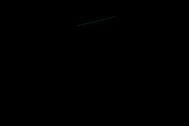

# Coscilloscope
A software-rendered oscilloscope simulation written in C. Doesn't depend on the C standard library.



# Dependencies
- FFmpeg

# Build Instructions
```sh
clang main.c -o coscilloscope
```

# Execution
Please make sure a folder named "output" exists in the project directory

```sh
./coscilloscope
./togif # Output will appear in the output folder
```
